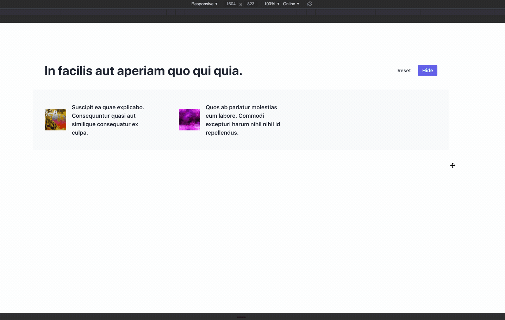
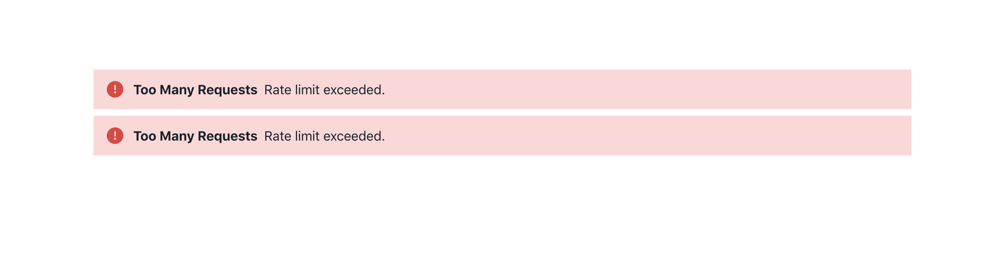

## Insight Timer React Exercise

### Libraries used

- [Chakra UI](https://chakra-ui.com/)
- Thats it 😊

### Preview



### When API hits rate limit



## How to run

It a normal create-react-app with TypeScript.

1. Create a `.env` file with the following content at the directory root

```
REACT_APP_GOREST_API_TOKEN=eBkJwF0AC-liANiOODV8HueLvKa-FhjOYygY
```

2. `yarn && yarn start` OR `npm install && npm start`

## Timesheet

- 6:00pm start
- 7:00pm dinner break
- 7:30 pm continue
- 8:34pm cleanup & documentation
